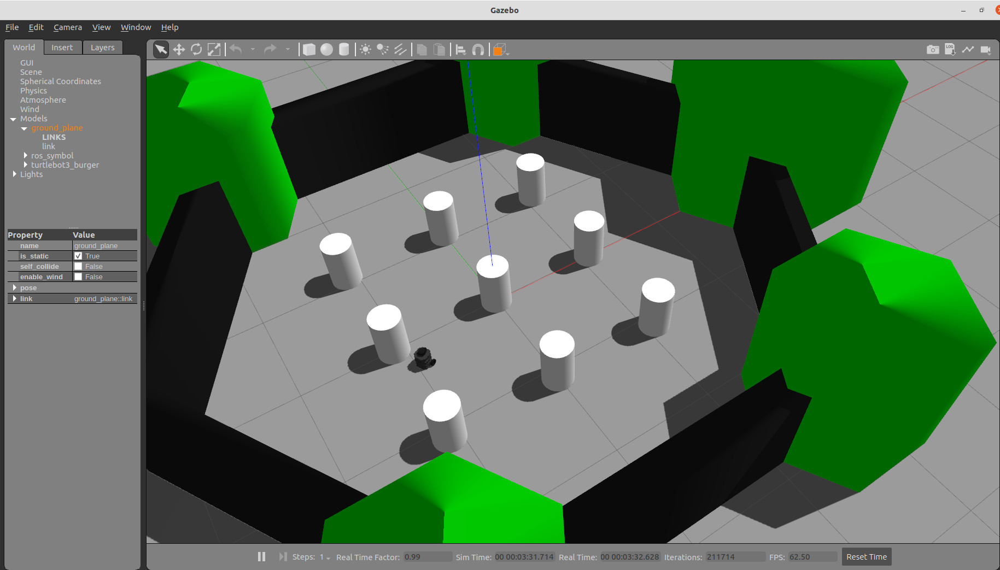

# Turtlebot path planning

This repository implements bug1 and bug2 algorithm for [Turtlebug3 Burger](https://emanual.robotis.com/docs/en/platform/turtlebot3/overview/) 
robot.

You can find the details of bug1 and bug2 algorithms [here](https://www.cs.cmu.edu/~motionplanning/lecture/Chap2-Bug-Alg_howie.pdf)

The code is developed using ros services.

## Installation
I tested this code on Ubuntu 20.04 with Ros Noetic.

Steps for installation:
1) Initialize your catkin working environment
2) Clone this repository to and move the "src" folder to your workspace
3) Run ```catkin_make``` in the root folder of your workspace


## How to run
First open a new terminal in the root folder of your workspace 
1) Run ```source devel/setup.bash```
2) Run ```export TURTLEBOT3_MODEL=burger```   
3) Put your world description file under "src/controller/worlds/" folder
4) Run ```export WORLD={name of your world file}```
5) Run ```roslaunch controller turtlebot3_world.launch ```

Now open a new terminal in the root folder of your workspace to run the client side
1) Run ```source devel/setup.bash```
2) Run ```rosrun controller control_client.py {x position} {y position} {bugone flag}``` 
* For instance ```rosrun controller control_client.py 2 0 True```
to get to x=2,y=0 with bug1 algorithm.
* ```rosrun controller control_client.py 2 0 False``` uses bug2 to get to the destination.


A picture of the robot in the Gazebo environment
